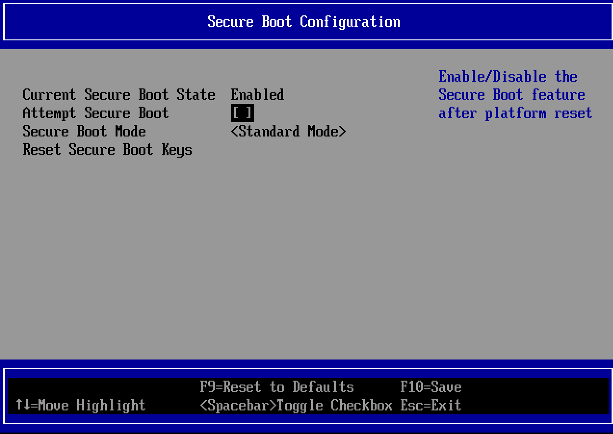

### Compiling Custom Linux Kernel

Update and install necessary packets:
```bash
sudo apt-get install libncurses-dev fakeroot wget bzip2 build-essential build-essential bc bison flex rsync libelf-dev libssl-dev libncurses-dev dwarves git debhelper ncurses-dev fakeroot wget bzip2
```

Download and unpack kernel source:
```bash
wget https://cdn.kernel.org/pub/linux/kernel/v6.x/linux-6.13.7.tar.xz #feel free to use any other version
tar -xf linux-6.13.7.tar.xz
cd linux-6.13.7
```

Generate a `.config` file:
```bash
make olddefconfig
```

Compile the kernel:
```bash
make bindeb-pkg -j `nproc` LOCALVERSION=-custom
```

Install the kernel packages after the compilation has succeeded:
```bash
cd ..
sudo dpkg -i *.deb
```

Reboot your machine:
```bash
sudo reboot
```

During the reboot, hit escape to enter UEFI menu. Navigate to "Device Manager", then "Secure Boot Configuration" and disable  the Secure Boot as shown in the screenshot. 
 

Reboot the machine and verify that you are using your custom kernel:
```bash
uname -r

# 6.13.7-custom
```

---

### Sign your kernel

Create a custom **MOK** (Machine Owner Key):

```bash
mkdir -p /var/lib/shim-signed/mok/
cd /var/lib/shim-signed/mok/
openssl req -nodes -new -x509 -newkey rsa:2048 -keyout MOK.priv -outform DER -out MOK.der -days 36500 -subj "/CN=My Name/"
openssl x509 -inform der -in MOK.der -out MOK.pem
```

*Note: using 4096 RSA keys might cause errors when loading and verifying grubx64.efi binary.*

Enroll the key using `mokutil`:
```bash
sudo mokutil --import /var/lib/shim-signed/mok/MOK.der
```

The system will prompt to enter a password, which has to be re-entered during the next reboot to complete the key enrolment inside MOK manager.

Sign the kernel:
```bash
VERSION="$(uname -r)"
sbsign --key MOK.priv --cert MOK.pem "/boot/vmlinuz-$VERSION" --output "/boot/vmlinuz-$VERSION.tmp"
sudo mv "/boot/vmlinuz-$VERSION.tmp" "/boot/vmlinuz-$VERSION"
```

Reboot the machine and re-enable secure boot.

Verify you are still running the same kernel with secure boot enabled:
```bash
uname -r
# 6.13.7-custom
mokutil --sb-state
# SecureBoot enabled
```

Verify that the kernel is signed by your key:
```bash
sbverify --list /boot/vmlinuz-$(uname -r)
# signature 1
# image signature issuers:
# - /CN=My Name
# image signature certificates:
# - subject: /CN=My Name
#   issuer:  /CN=My Name
```
  
---
  
### Unsigned Kernel with Secure Boot 

An attempt to compile and load an unsigned kernel with secure boot enabled results into following error:
```
Loading linux 6.13.7-unsigned ...
error: bad shim signature
Loading initial ramdisk ...
error: you need to load the kernel first.
```

Run the following command to leave secure boot enabled without enforcing it's rules:
```bash
sudo mokutil --disable-validation
```

- You will then have to enter a MOK administration password and reboot the machine.
- Press "Change Secure Boot State" Inside MOK management menu.
- Enter characters from the password out of order as the systems asks.
- Reboot the machine.

Verify the kernel version and the secure boot state:
```bash
uname -r
# 6.13.7-unsigned

mokutil --sb-state
# SecureBoot enabled
# SecureBoot validation is disabled in shim
```
